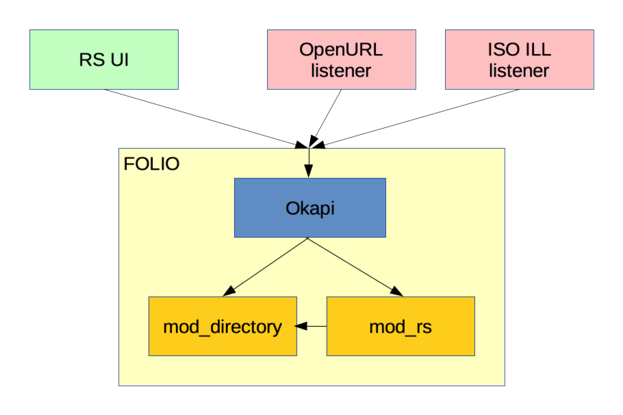
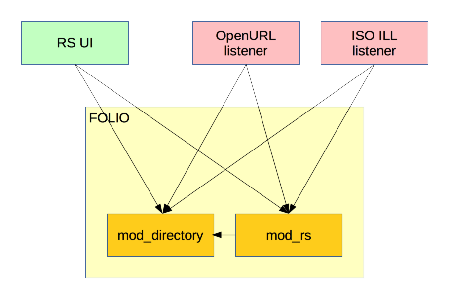

# Structure of a ReShare node

<!-- md2toc -l 2 structure-of-a-node.md -->
* [Assumptions](#assumptions)
* [Components](#components)
    * [Overview](#overview)
    * [The Resource Sharing UI](#the-resource-sharing-ui)
    * [Listeners](#listeners)
    * [mod_directory](#mod_directory)
    * [mod_rs](#mod_rs)

## Assumptions

We must start from the assumption that ReShare nodes need to run on behalf of libraries using many different ILSs, and many different single-sign-on (SSO) systems. In particular, we are not at liberty to assume that the library is using FOLIO. This has implications for integration: it will potentially be one of the most demanding parts of the whole project, since it potentially needs to encompass an _n_ × _m_ matrix.

We must assume, then, that a library that wants to use ReShare to allow patrons to borrow items already has a discovery layer, and that layer already has a "Get this" button of some form -- most likely generating an OpenURL, but maybe issuing an ISO ILL request, sending an email in a well-known format, or some other procedure.

## Components

### Overview

A single ReShare node will be made of the following components:

In this diagram:
* The green box indicates the administrative UI, which can be used to generate and process requests.
* The pink boxes represent Listeners: processes that listen for incoming requests via OpenURL, ISO ILL, email or any other supported process. There may be any number of these.
* The yellow box indicates an installation of the FOLIO LSP: not necessarily running any ILS components, but ReShare modules. It can be treated as a black box for most purposed.
* The blue box indicates Okapi, FOLIO's application gateway which routes WSAPI invocations to the correct modules
* The gold boxes indicate actual modules running within the FOLIO LSP.

Note that Okapi and the rest of the FOLIO LSP are off-the-shelf code from the FOLIO project. Only the green, pink and gold components need to be build specially for ReShare.

In FOLIO, all requests to modules are routed via Okapi, which takes care of routing, authentication and other matters -- as reflected in the diagram above. However, in can be clearer in conceptual terms to ignore Okapi, or to take it for granted, and simply to show client code calling into specific back-end modules, as in the following modified version of the diagram:

In this version, it can be clearly seen that the Resource Sharing UI and the listeners all communicate with both mod_directory and mod_rs. We shall discuss these interactions [below](#interactions).

### The Resource Sharing UI

This will be build on the FOLIO LSP's UI toolkit, Stripes, and will consist of several UI modules running within the Stripes container. The exact breakdown into UI modules has not yet been firmly established, but we expect a primary division between a single, relatively rarely used, Directory maintenance module; and a small set of more frequently used modules for the loan proess: perhaps broken down into Requesting, Suplying and Shipping.

### Listeners

Several listeners will be required: one for each of several different means of injecting a request in the ReShare system. One, for example, will receive OpenURL requests; another will receive ISO ILL requests. In each case, the job of the listener is to determine the identity of the patron who sent the request, and use this information together with that of the request to formulate a WSAPI call into mod_rs to initiate the loan procedure.

Determining the identity of the patron will not always be trivial: for example, an OpenURL in isolation contains only metadata about the sought item. The URL itself is not sufficient: the whole HTTP request is necessary, including tron headers and cookies. Not only that: there is no single method of determining patron identity from HTTP headers -- instead, the method will vary depending on the ILS's mechanisms, or more likely on the SSO system in use. It will therefore in general be necessary for each listener to include code for integrating with a selection of different discovery tools and SSO systems.

Another wrinkle also comes into play: before a listener can call into mod-rs (or any Okapi-mediated service) it needs to know which tenant is hosting the ReShare modules. So the listener needs a way of figuring out "This OpenURL is from that source, which means its associated with tenant X". This, too, will likely be discernable only in ways that vary between discovery system and SSO solutions.

### mod_directory

This module will be a repository for all the information that mod-rs needs to do its job. This will include at least the following:

* **Naming authorities** -- organisations that dole out symbols to designate libraries.
* **Symbols** -- short alphanumerical sequences that uniquely identify a library _within a given naming authority_.
* **Libraries** -- possible sources of loans, identified by a unique combination of naming authority and symbol.
* **Consortia** -- sets of libraries that have mutual inter-lending agreements. A given library may be a member of any number of consortia.

In addition to this information, which is universally true, the directory will need to hold information specific to the present library, indicating the cost of loaning items from libraries in different consortia. This information will be cruicial in choosing the best lending location, but can only be maintained on a per-library basis.

### mod_rs

This module will handle the actual resource-sharing processes, including maintaining a persistent state and ensuring that every request is processed. Its complexities are beyond the remit of this document.

